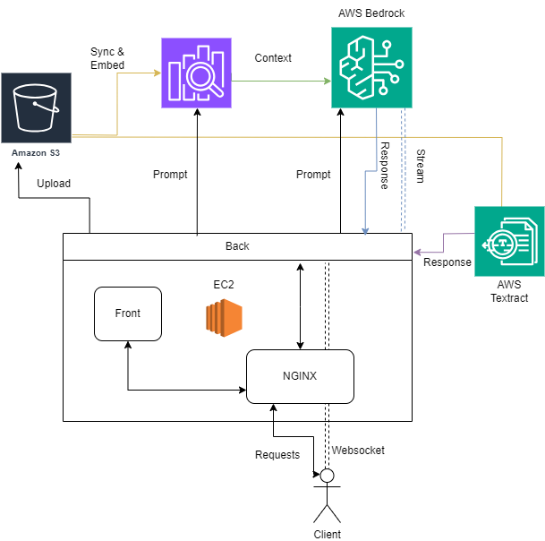

# Xposure - Analyse de l'image de marque pour Enedis

Xposure est une application développée par une équipe de Polytechniciens (X), conçue pour agréger des ressources médias et fournir des analyses approfondies de l'image de marque d'Engie.

---

## Fonctionnalités principales

### **Backend Django**
- Gestion des API pour l'agrégation de ressources médias.
- Analyse des données pour fournir des bilans sur l'image de marque.
- Système de gestion des utilisateurs avec des rôles personnalisés (analystes, administrateurs, etc.).

### **Frontend React (Vite) + MUI**
- Interface intuitive pour consulter et analyser les bilans d'image de marque.
- Tableaux de bord interactifs affichant des données clés et des insights visuels.
- Communication fluide avec l'API backend via des appels HTTP.
- Utilisation de MUI

### **Conteneurisation Docker**
- Conteneurs distincts pour le backend, le frontend, et le serveur Nginx.

### **Nginx**
- Proxy inverse pour servir les fichiers statiques et gérer les requêtes API.
- Optimisation pour un usage en environnement de production.

---

## Prérequis

- **Docker** et **Docker Compose** installés sur votre machine.
- **Git**

---

## Configuration

### Étape 1 : Cloner le projet depuis GitHub
Clonez le dépôt GitHub :
```bash
git clone https://github.com/Trick5t3r/Xposure.git
cd Xposure
```

### Étape 2 : Configurer le backend

1. Copiez le fichier d'exemple `.env` :
   ```bash
   cp backend/.env.example backend/.env
   ```

2. Modifiez les variables d'environnement dans le fichier `.env` pour y inclure les clés d'API, les mots de passe, et autres configurations spécifiques. (NB: il n'est plus utile de mettre une celf API Mistral)

3. Copiez le fichier d'exemple `.credentials` :
   ```bash
   cp backend/.aws/credentials.example backend/.aws/credentials
   ```

4. Modifiez les variables d'environnement dans le fichier `credentials` pour y inclure les clés d'API.

5. Vérifié qu'un fichier vide `db.sqlite3` existe dans le repertoire `/backend`, sinon (pour Linux):
   ```bash
   nano backend/db.sqlite3
   ```
   Le docker va créer un superuser avec le nom et le mdp définie dans .env (default test/test)

### Étape 3 : Configurer le frontend (par défaut : `localhost`)

1. Copiez le fichier d'exemple `.env` :
   ```bash
   cp frontend/.env.example frontend/.env
   ```

2. Ajoutez l'URL backend dans le fichier `.env`.
3. Mettre votre url dans les fichiers de conf ci-après:
   - **Modifier la conf nginx**
   ```bash
   nano nginx/nginx.conf
   ```
   - **Modifier la conf django**
   ```bash
   nano backend/backend/settings.py
   ```

### Étape 4 : Builder les conteneurs Docker

Lancez les commandes suivantes pour construire et démarrer les conteneurs :
```bash
docker-compose up --build -d
```
Et voilà, le serveur est en marche !

---

## Connexion en tant que superuser
Utilisez le `username_superuser` et le `MDP_superuser` pour vous connecter en tant que superuser (le superuser a le droit d'accès à l'url `/admin`)

## Commandes supplémentaires

- **Arrêter le serveur** :
  ```bash
  docker-compose down
  ```

- **Redémarrer le serveur** :
  ```bash
  docker-compose up
  ```

- **Lancer en arrière-plan** :
  ```bash
  docker-compose up -d
  ```

- **Rebuild un conteneur précisément** :
  ```bash
  docker-compose up -d
  ```

- **Lister les conteneurs actifs** :
  ```bash
  docker-compose up --build conteneur
  ```
  Avec `conteneur={nginx/backend/frontend}`

  - **Conection à un conteneur Docker** :
  ```bash
  docker exec -it conteneur /bin/sh
  ```
  Avec `conteneur={nginx/backend/frontend}`

- **Rebuild complet avec les fichiers requis Python** (pour Linux) :
  ```bash
  ./build_assets_force.sh
  ```

- **Exécution sans Docker** (pour Linux) :
  ```bash
  ./manage.sh start/stop
  ```

---

# Objectifs du projet

Le premier objectif du projet était de prendre un fichier Excel avec les colonnes `['Date','Territoire','Sujet','Thème','Qualité du retour','Média','Articles']` et de compléter les colonnes `['Thème','Qualité du retour']`

Ensuite, parmi les dépassements proposés, on a pu atteindre:
- prétraiter un pdf de revue médiatique pour le convertir en fichier Excel au bon format
- analyser les données obtenues
- faire un chatbot sur les fichiers
- générer un pdf de compte rendu des résultats

## Réalisation

**Outils proposés**
- Un dashboard de 5 pages:
  - File management
  - Geo analysis
  - Statistics
  - Ai assistant
  - Generate report

Des algos de classification, prétraitement et post traitement de pdf, un système rag

### Algos de classification
- **Prompting d'un LLM**: En utilisant les informations présentes, réalisation d'un prompt à un LLM afin de classer l'article (Qualité du retour, Thème). Les prompts employés ont été établit par l'analyse des données, Chaine of thought, formatage des données d'entrée.

- **Tentatives**: On a tenté d'implémenter un modèle BERT Finetuné mais les résultats étaient moins bon (convergeait vers le classifier de base)

- **Problèmes**: Dataset déséquilibré, mal formaté

### Algos de génération de pdf
- **Datas** : Utilisation du fichier Excel comme données d'entrée
- **Génération structure** : Génération de la structure du pdf, et des graphes
- **Génération contenu** : Génération du contenu du pdf, réalisation d'une analyse et interprétation de chaque graphe puis d'une synthèse globale, en utilisant un LLM multimodal.

### IA Assistant : Algos du système RAG (Retrieval-Augmented Generation)
Tout d'abord l'ai assistant reçoit un prompt.

Ce prompt est envoyé aux serveur d'aws qui nous génère un context à la question posée en se basant sur les fichiers uploadés (système RAG)

Puis ce context est mis en context de la question de l'utilisateur (avec l'historique de la conversation) et génère la réponse

**RAG**
- **Upload**: Il y a une phase d'upload en amont des données sur un serveur S3
- **Sync**: Il y a une phase de synchronisation qui va indexer tous les fichiers
- **Query**: Il y a une phase de query qui récupère les fichiers qui correspondent à la query (dans notre cas récupérer les contexts pertinents)

## Architecture


### Intégration d'AWS
- **EC2** : Hébergement de la solution sur EC2
- **S3** : Stockage des données pour le RAG et Textract
- **Textract** : Prétraitement des pdf pour les convertir en fichier Excel
- **Opensearch** : Indexation et recherche rapide des données extraites, facilitant l’accès aux informations dans un flux RAG.
- **Bedrock** : Interaction avec un modèle LLM pour générer des réponses enrichies et contextualisées

### Technologies additionnelles

#### Websocket
Pour rendre la solution plus dynamique, un WebSocket est mis en place entre l'utilisateur et le serveur. Ainsi, lorsque l'utilisateur envoie un prompt, celui-ci est récupéré et traité, puis invoke_model_with_response_stream est appelé. Cette fonction crée à son tour un tunnel entre le serveur et l'API AWS. À chaque nouveau token reçu, celui-ci est transmis en streaming au client.

#### Docker
Pour faciliter la mise en place du projet, sa scalabilité, et sa faciliter de repoduction.
En effet, en suivant le tutoriel la webapp peut-être installé sur n'importe quel ordinateur (dans notre cas testé en loaclhost et mis en place sur une instance EC2 d'AWS)

Cela permet également une meilleur gestion, en effet le backend est déployé sous forme d'api, donc on peut se dispenser d'utiliser le front.

Enfin, une instance nginx gère automatiquement l'intéraction de tous les dockers.

